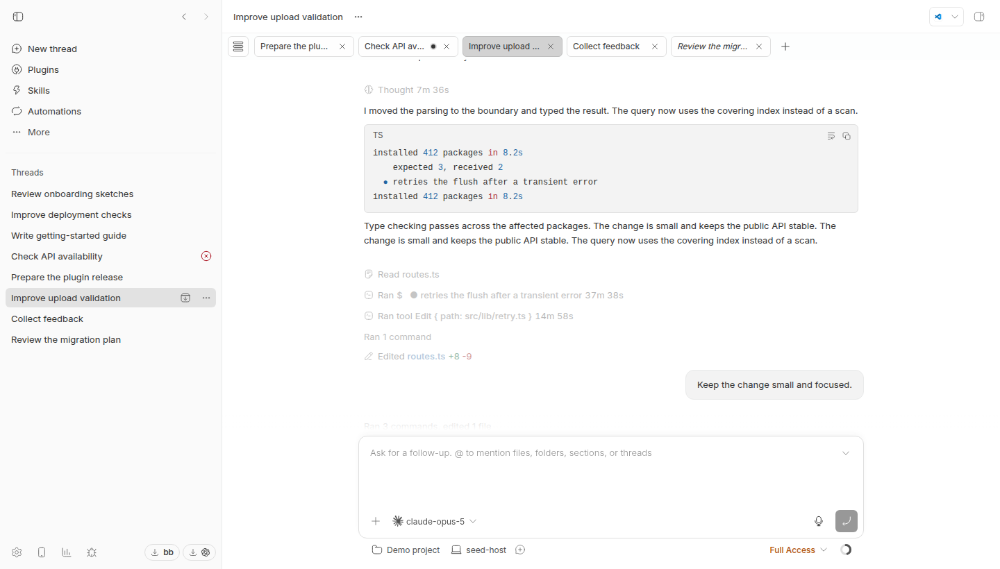
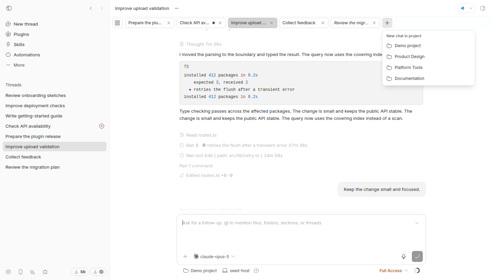
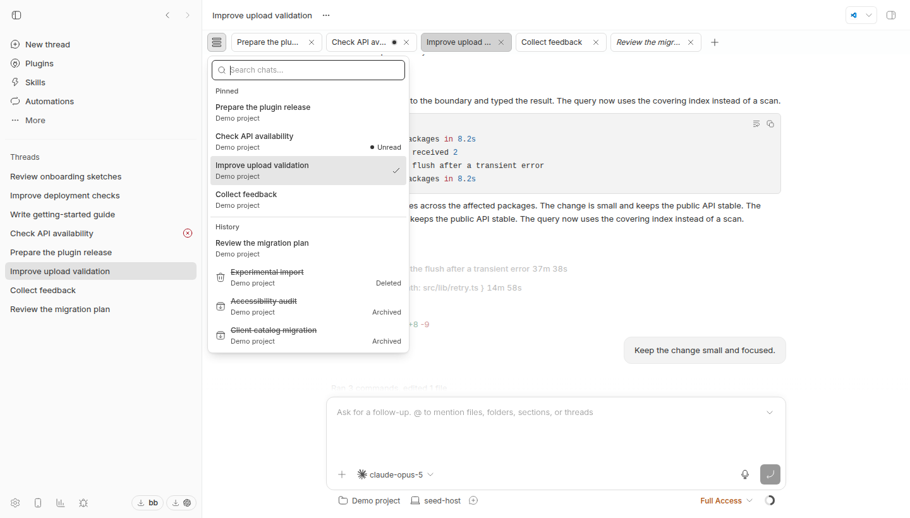
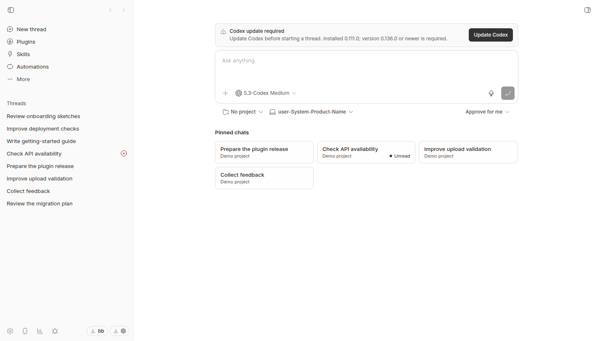

# Chat Tabs for BB

Chat Tabs adds VS Code-style pinned and preview chat tabs beneath BB's native
header. Switch chats, search recent conversations, or start a new chat in a
selected project directly from the strip. An optional pinned-chat list also
appears on the **New chat** screen. The BB sidebar remains available.









The screenshots show the real BB UI and the real plugin rendering with
synthetic demonstration data.

## Highlights

- **VS Code-style preview tab.** One unpinned preview represents a chat you opened but
  have not pinned. Opening another unpinned chat replaces it; background work
  never opens a preview. Closing it stays closed across reloads and other windows
  until you explicitly open that chat again. Its italic title makes the temporary state clear.
- **Pinned chats with a global manual order.** Double-click a preview tab to
  pin it. Drag pinned tabs between projects in one shared horizontal sequence;
  the preview always remains last and is never draggable. Double-click a pinned
  tab title to rename it inline.
- **Useful activity and unread signals.** The plugin detects pending input,
  workflows, background agents and commands, plan mode, goals, and runtime
  activity. Work in nested chats is folded into the visible root chat. Calm
  chats do not receive an empty status or decorative dot.
- **Create a chat from the strip.** A borderless plus after the last tab opens
  BB's native composer with the prompt focused. Hover for 300 ms to see the 15
  most recently active projects; **More** reveals the next 15 on click or after
  another 300 ms of hover. Choosing a project preselects it in the composer.
- **Pinned and recent navigation menu.** Open it by click, a 300 ms mouse
  hover, or two quick Shift presses. Search chat titles fuzzily, select a match
  with the arrow keys, and press Enter to open it. The menu lists **Pinned**
  chats and a plugin-owned **History** of up to 100 visits. The first eight
  history entries appear immediately; **More** loads the next page on click,
  tap, keyboard selection, or a 300 ms desktop hover. Both menus animate in
  and out and respect reduced-motion preferences.
- **Safe lifecycle handling.** Archive and delete events immediately remove a
  chat from tabs, pins, and the home list. A disabled history tombstone remains
  with an Archived or Deleted label. Unarchiving makes that history item
  clickable again but intentionally does not restore its old pin or preview.
- **Desktop and touch behavior.** Desktop supports drag and drop, horizontal
  mouse-wheel scrolling, a conditional top scrollbar, middle-click close,
  `Ctrl+Tab` / `Ctrl+Shift+Tab`, and `Ctrl+W` / `⌘W` in BB Desktop. Touch
  layouts keep a 44×44 target, native horizontal swipe, and explicit Close
  buttons instead of HTML drag and drop.
- **Native-feeling actions.** The tab context menu offers Copy link, Mark as
  unread, Pin/Unpin, Rename, and Archive. Links are absolute and retain a
  textarea fallback when the Clipboard API is unavailable.
- **Theme-aware presentation.** The stylesheet uses BB semantic theme tokens
  and `color-mix(in oklch)` rather than hard-coded UI colors. It follows light,
  dark, and custom BB themes.

## Settings

All settings are available in **Settings → Installed plugins → Chat Tabs** or
through `bb plugin config tabs set <key> <value>`. They affect only the
presentation: pins, preview state, manual order, and visit history remain
stored.

| Key | Default | Purpose |
| --- | --- | --- |
| `showPinnedTabsList` | `true` | Quick pinned-chat list below the composer on the New chat screen. |
| `showTabsOnDesktop` | `true` | Top tab strip in the desktop layout. |
| `showTabsOnMobile` | `true` | Top tab strip in the compact/mobile layout (`≤767px` or a coarse pointer). |
| `showTabListButton` | `true` | Icon button for the dropdown list next to the strip. |
| `showTabListPinned` | `true` | Pinned section in the dropdown list. |
| `showTabListHistory` | `true` | History section in the dropdown list; hiding it does not stop recording visits. |
| `tabListButtonPosition` | `Left` | Side for the icon button: `Left` or `Right`. |

The list button hides automatically when it is disabled or fewer than two
allowed navigation targets remain.

## Design boundaries

Tabs and history live in plugin-owned `bb.storage.kv` state and synchronize
across windows through plugin realtime channels. They are not derived from the
BB sidebar and never replace it.

The implementation uses the public `homepageSection` API, the experimental
`experimental_appOverlay` API, and declarative `bb.settings.define`. It does
not modify BB core, replace sidebar slots, call `threads.tabs.update`, reparent
host DOM, inject into the native header, or use content scripts.

BB does not currently expose a public layout slot inside the native thread
chrome. The visual reservation for the overlay is therefore a deliberately
scoped CSS hybrid:

- a single main chat pane reserves space for the tab strip;
- a regular right panel does not count as a split and is not overlapped;
- a true split pane, full-screen right panel, sidebar drawer, or mobile right
  panel drawer hides the overlay and its portal menu;
- desktop uses a synchronized top proxy scrollbar only when the strip actually
  overflows; touch layouts retain native horizontal swipe;
- CSS anchors follow the main chat pane and sidebar without DOM mutation.

If BB changes its internal layout, validate the visual integration manually.
The plugin state itself remains independent of that layout.

## Development

```bash
npm install
npm run typecheck
npm test
npm run build
```

For a live development cycle in BB:

```bash
bb plugin dev
```

To install the local plugin after building it:

```bash
bb plugin install .
```

Chat Tabs requires BB `0.43+` and Plugin SDK `0.4.97+`.

See the [changelog](CHANGELOG.md) for version history.

## License

[MIT](LICENSE). You may use, copy, modify, distribute, and publish forks while
retaining the license text and copyright notice.
